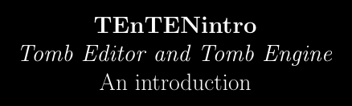

# **T**omb **E**ditor a**n**d **T**omb **En**gine: an **intro**duction

## Introduction
This project aims to write an introductory book on how to use *Tomb Editor* (aka **TE**) and *Tomb Engine* (aka **TEN**) to build Tomb Raider custom levels. Please note currently it's in a very early phase.

## Why?
Let me introduce myself: I'm Ricky, from Italy and I'm passionated about everything related to Tomb Raider. I use to stream myself on Twitch, playing main TR games as well as custom levels made by the community.

At some point, I've decided I want to learn how to make custom levels on my own, using the most recently released *Tomb Engine*. Out there online, I've found so many great introductory materials, tutorials and forum pages, mostly covering specific parts of the games building process.

So I've started to write some notes based on this material day by day, describing step by step all available features. And these notes, naturally became a book.

I've decided to make it public while drafting, hoping it could be a support *to every noob like me* who is interested in learning how to make stuffs with Lara through the editor 😊

## How?

The book is written using LaTeX. I'm currently using *TeX Live* on Windows for compiling and *VS Code* and its extensions for drafting and publishing.

## Affiliations

This project is not affiliated in any way to the official [Tomb Engine](https://tombengine.com/). I take the occasion to personally thank the Editor and Engine development team for their amazing work ❤️

## Contributions

Any contribution to the project is more than welcome! Feel free to propose any suggestion through a PR, or getting in touch directly with me 🤗